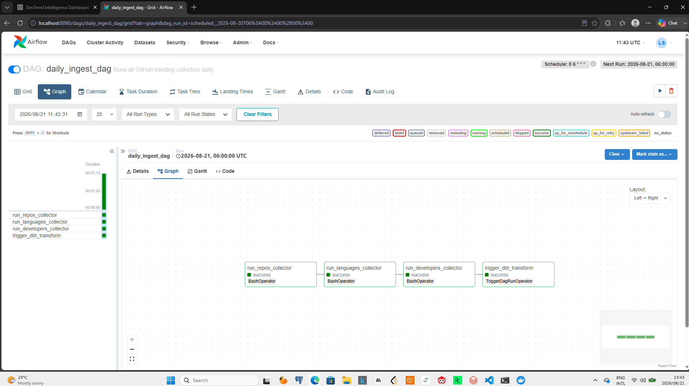
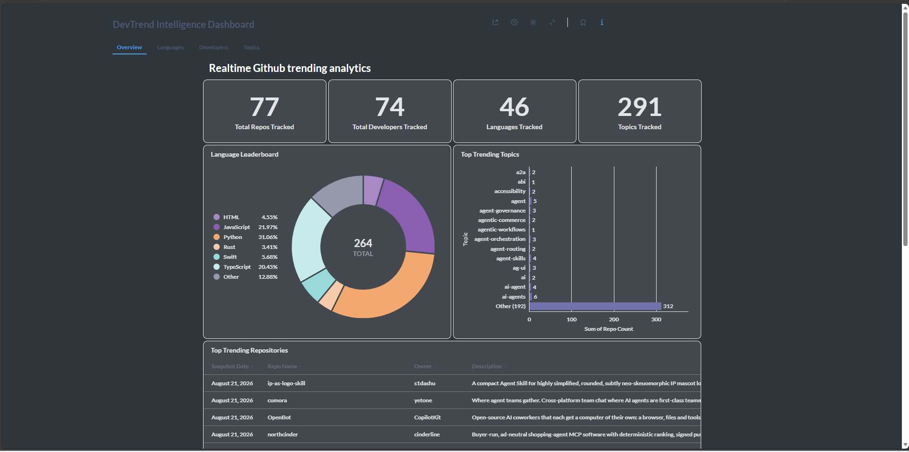
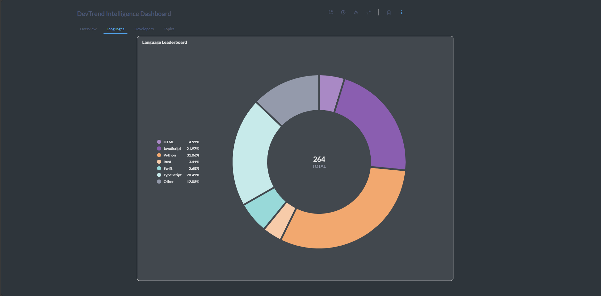
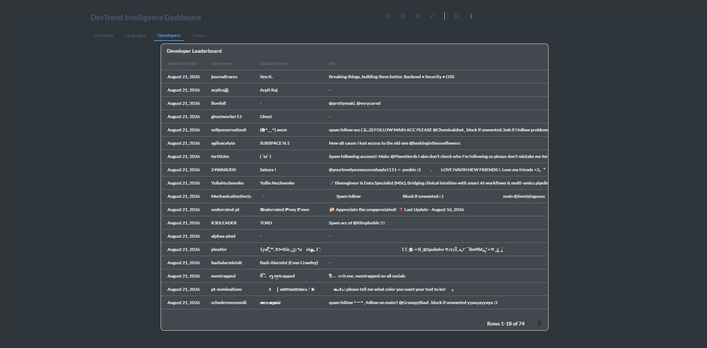
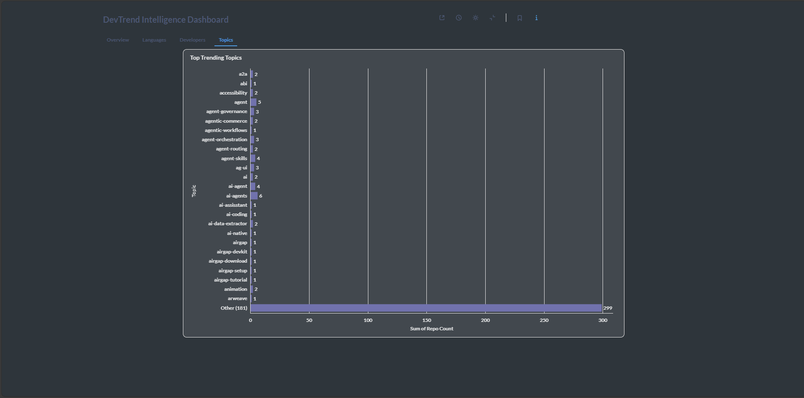

# DevTrend Intelligence Platform

> **End-to-End Data Engineering Pipeline for GitHub Trend Analytics**


---

## What I Built

GitHub surfaces trending repositories, languages, and developers every day but that data disappears. There is no historical record, no way to track which languages are growing, and no way to measure how fast a project gained traction.

I built a pipeline that captures this data every day, stores it in PostgreSQL, transforms it through a three-layer dbt model, and serves it through a live Metabase dashboard.

The question it answers: **What technologies is the global developer community moving towards  and how fast?**

## Why I Built It

I wanted a project that covered the full data engineering stack in one place  not just moving data, but orchestrating it, testing it, modeling it, and visualising it. I chose GitHub trending data specifically because it updates daily, the API is free, and the insights are immediately interesting to any technical interviewer.

I also wanted to push myself to learn dbt properly, because most of my earlier projects did transformations inside Python scripts rather than in a proper modeling layer.
---

## Architecture

```
GitHub API
    │
    ▼
Python Collectors (3 scripts)
    │   repos_collector.py
    │   languages_collector.py
    │   developers_collector.py
    │
    ▼
PostgreSQL — Raw Tables
    │   raw_trending_repos
    │   raw_language_trends
    │   raw_trending_developers
    │   pipeline_runs
    │
    ▼
Apache Airflow — Orchestration
    │   daily_ingest_dag.py     → runs collectors daily at 06:00 UTC
    │   dbt_transform_dag.py    → runs dbt after ingestion
    │   data_quality_dag.py     → runs tests and alerts on failure
    │
    ▼
dbt — Transformation
    │   Staging     → clean and standardise raw data
    │   Intermediate → join and enrich
    │   Marts       → analytics-ready tables
    │
    ▼
Metabase Dashboards
        Trending Repos · Language Leaderboard · Repo Growth
        Topic Trends · Developer Leaderboard · Pipeline Health
```
## Orchestration

Apache Airflow orchestrates the full pipeline on a daily schedule. The DAG runs all three collectors in sequence, then triggers dbt transformations automatically.

### Daily Ingest Pipeline — All Tasks Passing


---
## Dashboard

### Overview


### Language Leaderboard


### Developer Leaderboard


### Topic Trends


---

## Tech Stack

| Tool | Version | Role |
|---|---|---|
| Python | 3.11 | API collectors, data validation, pipeline logic |
| Apache Airflow | 2.8 | Orchestration, scheduling, monitoring |
| dbt | 1.7 | SQL transformations, testing, documentation |
| PostgreSQL | 15 | Raw and analytics data storage |
| Metabase | v0.49 | Dashboards and visualisations |
| Docker + Compose | Latest | Containerisation and local deployment |
| GitHub Actions | — | CI/CD on every push |

---

## Project Structure

```
devtrend-intelligence-platform/
│
├── src/
│   ├── collectors/
│   │   ├── repos_collector.py          # fetches trending repositories
│   │   ├── languages_collector.py      # fetches language distribution
│   │   └── developers_collector.py     # fetches trending developers
│   │
│   └── common/
│       ├── config.py                   # centralised configuration
│       ├── database.py                 # reusable database connection
│       ├── github_client.py            # GitHub API client
│       ├── logging_config.py           # structured logging setup
│       └── pipeline_run.py             # pipeline run monitoring
│
├── airflow/
│   └── dags/
│       ├── daily_ingest_dag.py         # ingestion pipeline DAG
│       ├── dbt_transform_dag.py        # dbt transformation DAG
│       └── data_quality_dag.py         # data quality testing DAG
│
├── dbt/
│   └── models/
│       ├── staging/                    # stg_trending_repos, stg_language_trends, stg_trending_developers
│       ├── intermediate/               # int_repos_with_language_rank, int_repo_daily_growth
│       └── marts/                      # mart_trending_repos, mart_language_leaderboard, mart_repo_growth
│
├── sql/
│   └── init/
│       ├── 001_create_databases.sql
│       └── 002_schema.sql
│
├── docker/
│   ├── Dockerfile.airflow
│   ├── Dockerfile.collectors
│   └── Dockerfile.dbt
│
├── docker-compose.yml
├── .env.example
├── requirements.txt
└── README.md
```

---

## How to Run Locally

### Prerequisites
- Docker Desktop installed and running
- Git

### Setup

**1. Clone the repository**
```bash
git clone https://github.com/lwando-sokhanyile/devtrend-intelligence-platform.git
cd devtrend-intelligence-platform
```

**2. Configure environment variables**
```bash
cp .env.example .env
```

Open `.env` and fill in your values:
```
DB_USER=devtrend_user
DB_PASSWORD=your_password
DB_NAME=devtrend_db
AIRFLOW_FERNET_KEY=your_fernet_key
AIRFLOW_SECRET_KEY=your_secret_key
GITHUB_TOKEN=your_github_token  # optional but recommended
```

Generate the Airflow keys:
```bash
python -c "from cryptography.fernet import Fernet; print(Fernet.generate_key().decode())"
python -c "import secrets; print(secrets.token_hex(32))"
```

**3. Start the platform**
```bash
docker-compose up --build
```

**4. Access the services**

| Service | URL | Credentials |
|---|---|---|
| Airflow | http://localhost:8080 | admin / your_password |
| Metabase | http://localhost:3000 | set on first login |
| PostgreSQL | localhost:5432 | from your .env |

---

## Data Pipeline

### What Gets Collected Daily

**Trending Repositories**
- Repository name, owner, description
- Primary language, star count, fork count
- Topics and tags, GitHub URL

**Language Distribution**
- Which languages appear most in trending repos
- Repo count per language
- Daily language rank (1st, 2nd, 3rd most trending)

**Trending Developers**
- GitHub username and display name
- Follower count, public repo count
- Location and bio

### dbt Model Layers

```
RAW (loaded by collectors)
    ↓
STAGING (cleaned, standardised, typed)
    ↓
INTERMEDIATE (joined, enriched, calculated)
    ↓
MARTS (business-ready, dashboard-ready)
```

### Mart Tables

| Table | Description |
|---|---|
| `mart_trending_repos` | Daily top repos with stars, language, rank |
| `mart_language_leaderboard` | Language rankings with 7-day and 30-day trend scores |
| `mart_repo_growth` | Fastest growing repos by star velocity |
| `mart_topic_trends` | Most common repository topics per day |
| `mart_developer_leaderboard` | Trending developers with language and popular repo |
| `mart_pipeline_health` | Pipeline run monitoring — success rates and durations |


---

## Key Design Decisions

**Why GitHub API?**
Free, reliable, well-documented, and requires no API key for basic endpoints. Rate limit increases from 60 to 5,000 requests/hour with a free token.

**Why PostgreSQL over a data warehouse?**
For a project of this scale, PostgreSQL handles everything needed — dbt transformations, Metabase queries, and Airflow metadata. No extra cost or complexity.

**Why Metabase over Tableau or QuickSight?**
Metabase is free, open-source, runs in Docker alongside everything else, and connects directly to PostgreSQL. The dashboard logic transfers to any BI tool.

**Why LocalExecutor for Airflow?**
This project runs on a single machine. LocalExecutor is the right choice — no need for the complexity of CeleryExecutor or KubernetesExecutor at this scale.

---

## Challenges & Lessons

**PostgreSQL authentication across Docker and Windows** The collectors and dbt both needed to connect to PostgreSQL, but one ran inside Docker and the other ran from my Windows terminal. They couldn't use the same port. After testing the connection at different layers I discovered a local PostgreSQL 18 installation was already running on port 5432. Docker PostgreSQL was mapped to 5433 for external connections, and all local tooling had to be updated to reflect this. A simple problem that took significant debugging to trace.

**Airflow memory on an 8GB machine** Running Airflow webserver, scheduler, and PostgreSQL together consistently hit memory limits and caused gunicorn to time out. The fix was reducing Airflow to a single worker and separating development workflow from orchestration dbt and collectors run directly from the terminal during development, and Airflow is used only for scheduling in the final setup.

**dbt modeling discipline** My earlier projects did transformations in Python. Learning to keep transformation logic in SQL and use dbt's ref() system for dependencies required a different way of thinking. The lineage graph that dbt generates made it easier to reason about what depended on what.

**Idempotency** The first version of the repos collector inserted duplicates on every run. Adding ON CONFLICT DO NOTHING on the unique constraint fixed it and made the pipeline safe to run multiple times without side effects.

---

## Data Quality

Every collector run logs to a pipeline_runs table records fetched, inserted, skipped, duration, and status. dbt runs automated tests after every transformation: not_null, unique, and accepted_values on all critical columns.

---

## Author

**Lwando Sokhanyile** — Self-taught Data Engineer

- GitHub: [@lwando-sokhanyile](https://github.com/lwando-sokhanyile)
- LinkedIn: [linkedin.com/in/lwando-sokhanyile](https://linkedin.com/in/lwando-sokhanyile)

---

*Built as a portfolio project to demonstrate end-to-end data engineering skills.*